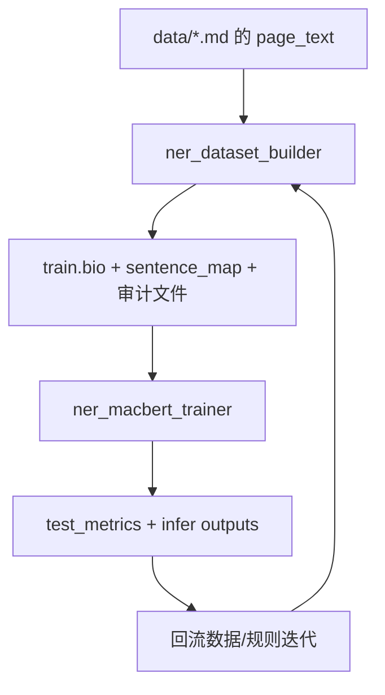

# NER 双工程总览

本仓库包含两个串联的工程：

- 上游：`ner_dataset_builder`（基于 Qwen 4B 的数据集构建）
- 下游：`ner_macbert_trainer`（基于上游语料的 MacBERT NER 训练与推理）

如果你是第一次接手，建议先看这份总览，再分别进入各工程 SOP 查看细节。

## 仓库结构

```text
NER/
├── data/                        # 原始 md 数据
├── doc/                         # 领域文档
├── ner_dataset_builder/         # 上游：LLM 抽取并产出 BIO 语料
│   └── sop/MANUAL_GEO.md
└── ner_macbert_trainer/         # 下游：训练/评估/导出/推理
    └── sop/MANUAL_MACBERT_NER.md
```

## 两个工程分别做什么

### 1) ner_dataset_builder（上游）

- 读取 `data/*.md` 中的 `page_text`
- 调用 LLM 做实体抽取并转为 BIO 训练语料
- 输出训练所需与审计所需文件（如 `train.bio`、`train.sentence_map.tsv` 等）

详细说明请看：
- [ner_dataset_builder/sop/MANUAL_GEO.md](./ner_dataset_builder/sop/MANUAL_GEO.md)

### 2) ner_macbert_trainer（下游）

- 消费上游产出的 BIO 语料
- 训练并评估 MacBERT NER
- 可导出 ONNX 并执行推理/双模型融合推理

详细说明请看：
- [ner_macbert_trainer/sop/MANUAL_MACBERT_NER.md](./ner_macbert_trainer/sop/MANUAL_MACBERT_NER.md)

## 两工程如何“通讯”

上游与下游通过文件进行解耦通信，不直接 RPC：

- 上游产出（供下游消费）
  - `ner_dataset_builder/output/train.bio`
  - `ner_dataset_builder/output/train.sentence_map.tsv`
  - （可选）`train.bi_only.tsv`、`train.bi_spans.tsv`、`rules.audit.tsv`
- 下游回传（供数据侧迭代）
  - `ner_macbert_trainer/output/test_metrics.json`
  - 推理产出与误差样本分析结果

建议联调时同步“数据版本 + 规则变更 + 清洗口径（如 table 处理）”，具体规范见下游 SOP 的“通讯交互规范”章节。

## 运行关系图



## 如何启动（最小路径）

以下仅给最小启动路径，参数细节与完整命令请进入各自 SOP。

### Step 1：先跑上游数据构建

```bash
cd /home/superuser/dev/NER/ner_dataset_builder
pip install -r requirements.txt
python main.py ...
python extract_bi_for_review.py ...
```

完整参数与样例命令：
- [ner_dataset_builder/sop/MANUAL_GEO.md](./ner_dataset_builder/sop/MANUAL_GEO.md)

### Step 2：再跑下游训练与推理

```bash
cd /home/superuser/dev/NER/ner_macbert_trainer
pip install -r requirements.txt
torchrun --nproc_per_node=<N> main_train.py --config conf/training_args.yaml
python export_onnx.py --config conf/training_args.yaml
python inference_onnx.py ...
```

完整流程（含双模型）：
- [ner_macbert_trainer/sop/MANUAL_MACBERT_NER.md](./ner_macbert_trainer/sop/MANUAL_MACBERT_NER.md)

## 推荐阅读顺序

1. 本文件（仓库总览）
2. 上游 SOP：`ner_dataset_builder/sop/MANUAL_GEO.md`
3. 下游 SOP：`ner_macbert_trainer/sop/MANUAL_MACBERT_NER.md`

## 注意事项

- 本仓库默认不提交模型、checkpoint、ONNX 等大文件（见 `.gitignore`）
- 如果需要复现实验产物，请在本地单独保留输出目录，不要纳入 Git 版本管理
