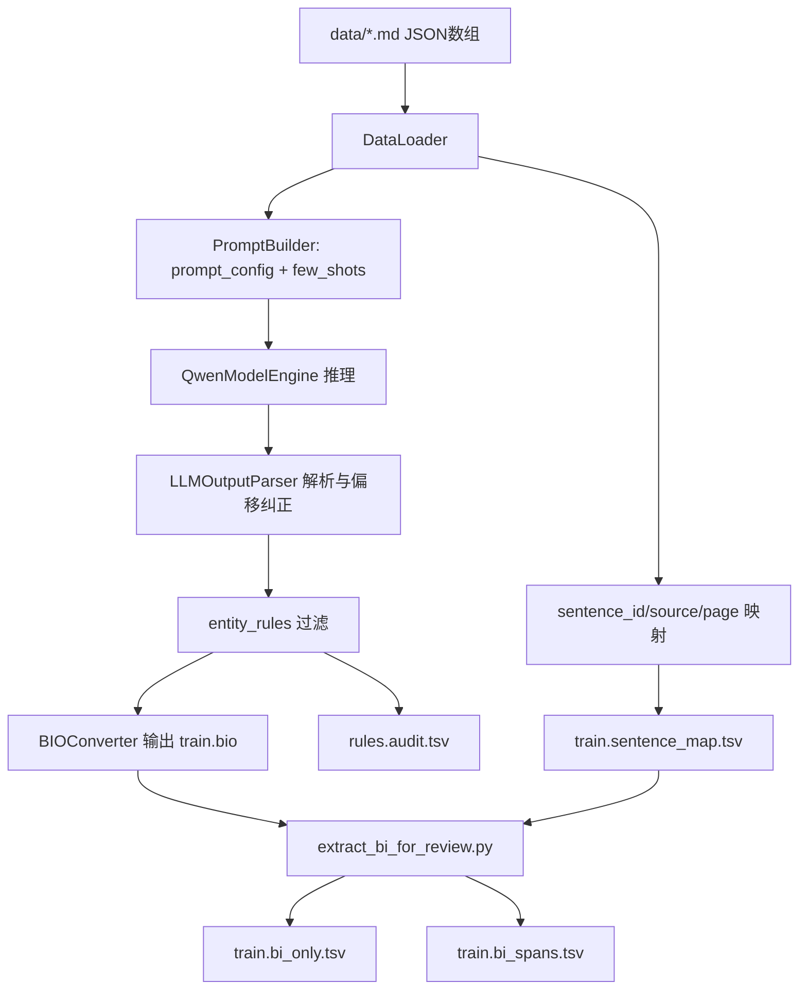

# NER Dataset Builder SOP

## 1. 工程目录介绍

本工程用于把 `data/*.md(JSON数组)` 自动转换为可训练 NER 数据，并支持基于规则的质量迭代。

### 1.1 目录结构（结构化展示）

```text
ner_dataset_builder/
├── main.py
├── extract_bi_for_review.py
├── requirements.txt
├── configs/
│   ├── prompt_config.json
│   ├── few_shots.yaml
│   └── entity_rules.yaml
├── core/
│   ├── __init__.py
│   ├── data_loader.py
│   ├── prompt_builder.py
│   ├── model_engine.py
│   ├── parser.py
│   └── bio_converter.py
└── output/
    ├── train.bio
    ├── train.sentence_map.tsv
    ├── rules.audit.tsv
    ├── train.bi_only.tsv
    └── train.bi_spans.tsv
```

### 1.2 核心文件职责

- `main.py`：主流水线（加载数据 -> LLM抽取 -> BIO输出 -> 映射输出 -> 规则审计输出），支持多卡并行。
- `extract_bi_for_review.py`：将 `train.bio` 转为人工复核友好的 `train.bi_only.tsv` 和 `train.bi_spans.tsv`。
- `configs/prompt_config.json`：系统指令、任务描述、生成参数模板。
- `configs/few_shots.yaml`：少样本示例，决定实体抽取风格。
- `configs/entity_rules.yaml`：规则过滤层（如 `well_name` 正则约束）。
- `output/`：训练输入与审核中间件的最终落地目录。

---

## 2. Sample 命令（全流程）

```bash
/home/superuser/.conda/envs/dsbi/bin/python /home/superuser/dev/NER/ner_dataset_builder/main.py \
  --input-dir /home/superuser/dev/NER/data \
  --model-path /home/superuser/LLM_Model/Qwen3.5-4B \
  --prompt-config /home/superuser/dev/NER/ner_dataset_builder/configs/prompt_config.json \
  --few-shots /home/superuser/dev/NER/ner_dataset_builder/configs/few_shots.yaml \
  --rules-config /home/superuser/dev/NER/ner_dataset_builder/configs/entity_rules.yaml \
  --output-file /home/superuser/dev/NER/ner_dataset_builder/output/train.bio \
  --sentence-map-file /home/superuser/dev/NER/ner_dataset_builder/output/train.sentence_map.tsv \
  --rules-audit-file /home/superuser/dev/NER/ner_dataset_builder/output/rules.audit.tsv \
  --num-workers 5 \
  --gpu-ids 0,1,2,3,4 \
  --max-input-chars 3000 \
  --max-new-tokens 128 \
&& /home/superuser/.conda/envs/dsbi/bin/python /home/superuser/dev/NER/ner_dataset_builder/extract_bi_for_review.py \
  --input-file /home/superuser/dev/NER/ner_dataset_builder/output/train.bio \
  --bi-lines-output /home/superuser/dev/NER/ner_dataset_builder/output/train.bi_only.tsv \
  --spans-output /home/superuser/dev/NER/ner_dataset_builder/output/train.bi_spans.tsv \
  --sentence-map-file /home/superuser/dev/NER/ner_dataset_builder/output/train.sentence_map.tsv
```

### 2.1 第一段命令参数说明（主流程）

- `--input-dir`：输入 JSON 数组文件目录（每个对象包含 `page_text`）。
- `--model-path`：本地模型权重路径。
- `--prompt-config`：Prompt 模板和 generation_config 配置。
- `--few-shots`：few-shot 样例库。
- `--rules-config`：实体规则文件，支持空文件或不存在（不影响初始化）。
- `--output-file`：BIO 训练文件输出。
- `--sentence-map-file`：样本与来源映射（可回溯至文件与页号）。
- `--rules-audit-file`：规则过滤审计日志。
- `--num-workers`：并行进程数。
- `--gpu-ids`：并行使用的 GPU 列表（逗号分隔）。
- `--max-input-chars`：每条文本最大字符数，超长截断提速。
- `--max-new-tokens`：生成 token 上限，控制推理时长。

### 2.2 第二段命令参数说明（复核导出）

- `--input-file`：BIO 原始输出。
- `--bi-lines-output`：仅 B/I 逐字行导出（便于 spot check）。
- `--spans-output`：实体片段级导出（便于规则整理）。
- `--sentence-map-file`：用于还原 `sentence_id` 与来源映射。

### 2.3 迁移到新环境时的参数配置小结

为方便其他开发人员快速迁移，建议按“先改路径、再改算力、最后改策略”的顺序配置参数：

- 路径参数先对齐：`--input-dir`、`--model-path`、`--prompt-config`、`--few-shots`、`--rules-config`、所有 `output` 路径。
- 算力参数再对齐：根据机器 GPU 数量修改 `--num-workers` 与 `--gpu-ids`（两者保持一致）。
- 推理策略后微调：按新环境吞吐和质量要求调整 `--max-input-chars` 与 `--max-new-tokens`。
- 两段命令强绑定：第二段复核导出命令的 `--input-file`、`--sentence-map-file` 必须指向第一段最新输出。
- 最小可用集优先：迁移初次运行建议先用小样本目录验证参数无误，再切换全量目录。

---

## 3. 工程示意图（设计思路 + 运行逻辑）



---

## 4. 训练后如何 Validate 与迭代 Update Policy

### 4.1 每轮完成后的最小验证清单

- 校验文件是否生成：`train.bio`、`train.sentence_map.tsv`、`rules.audit.tsv`、`train.bi_only.tsv`、`train.bi_spans.tsv`。
- 校验数据预处理策略：`page_text` 中 `<table>...</table>` 区块默认已剔除，不参与本流程抽取。
- 在 `train.bi_spans.tsv` 抽样检查实体质量（每类至少抽样 20 条）。
- 在 `rules.audit.tsv` 检查是否存在误杀（规则过滤过严）或漏杀（规则过宽）。
- 对比前一轮实体分布（每类数量、平均 span 长度、异常高频词）。

### 4.2 Output 说明

- `train.bio`：最终训练 BIO 文件（字符级标签）。
- `train.sentence_map.tsv`：样本索引与来源映射（`sentence_id/source_file/page_number/block_index/text`）。
- `rules.audit.tsv`：被规则过滤的实体及原因（`excluded_text` / `not_match_include_patterns`）。
- `train.bi_only.tsv`：仅 B/I 标签逐字导出，适合人工快速浏览。
- `train.bi_spans.tsv`：实体片段导出（训练前规则迭代的主输入）。

### 4.3 `train.bi_spans.tsv` 样例（5行）

```tsv
SN0015-08 井录井完井报告.md__p1	block	7	12	鄂尔多斯盆地
SN0015-08 井录井完井报告.md__p1	block	13	16	伊陕斜坡
SN0015-08 井录井完井报告.md__p1	well_name	31	39	SN0015-08
SN0015-08 井录井完井报告.md__p2	block	7	16	鄂尔多斯盆地伊陕斜坡
SN0015-08 井录井完井报告.md__p2	well_name	220	221	第井
```

---

## 5. 基于产出数据构建与更新 `entity_rules`

目标：把“可训练实体”与“噪声实体”分开，提升稳定性。

### 5.1 规则迭代示例（well_name）

人工发现样例：

```text
well_name    31    33    井二井
well_name     7    15    SN0015-08
```

策略：只允许 `SN` 开头井名（例如 `SNxxxxxx` / `SNxxxx-xx`），其他过滤。

`configs/entity_rules.yaml` 示例：

```yaml
well_name:
  include_patterns:
    - "^SN[0-9A-Za-z-]{3,20}$"
  exclude_texts:
    - "第井"
```

### 5.2 更新规则 SOP

1. 从 `train.bi_spans.tsv` 拉取目标实体（如 `well_name`）候选。
2. 人工标记“保留/剔除”样本，归纳正则和黑名单。
3. 修改 `configs/entity_rules.yaml`。
4. 重新执行全流程命令。
5. 对比新旧 `rules.audit.tsv` 与 `train.bi_spans.tsv`，确认误杀/漏杀下降。

---

## 6. 总结：首次启动与后续迭代

### 6.1 第一次运行（无 rules、无 output）

- `output/` 可为空，程序会自动创建输出文件。
- `rules` 可先留空或不提供真实规则（空文件/不存在都可初始化）。
- 首跑目标：先拿到可审阅的 `train.bi_spans.tsv` 与 `rules.audit.tsv`。

### 6.2 第二次及后续迭代

重点查看三类文件并更新：

- `train.bi_spans.tsv`：看抽取质量，识别假阳性与漏标模式。
- `rules.audit.tsv`：看规则误杀/漏杀，迭代 `entity_rules.yaml`。
- `configs/prompt_config.json` 与 `configs/few_shots.yaml`：修正抽取边界与定义。
- `core/data_loader.py` 的预处理规则：确认 `<table>` 标签内容仍由独立任务处理，不回流到当前NER流水线。

推荐节奏：

1. 规则小步更新（每次只改少量规则）。
2. Prompt 与 few-shots 只改一个维度，便于归因。
3. 每轮保留“命令 + 配置快照 + 样本对比结论”。
