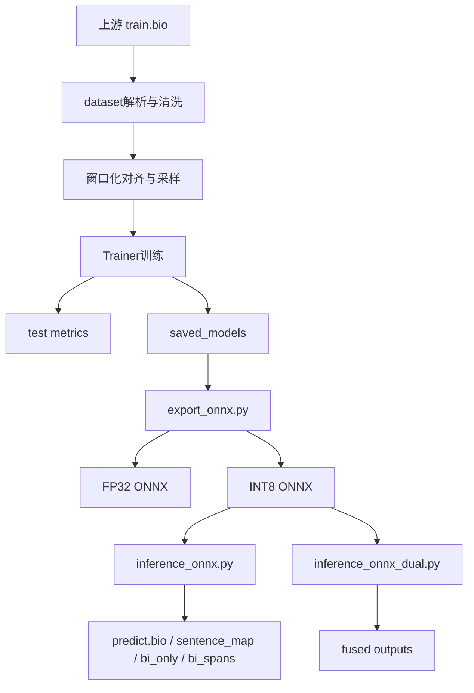

# NER MacBERT Trainer SOP

## 1. 工程目录介绍

本工程用于将上游生成的 BIO 语料训练为可部署 NER 模型，并输出 ONNX 推理产物。

### 1.1 目录结构（结构化展示）

```text
ner_macbert_trainer/
├── main_train.py
├── export_onnx.py
├── inference_onnx.py
├── inference_onnx_dual.py
├── conf/
│   ├── training_args.yaml
│   ├── training_args.dual_base.yaml
│   └── training_args.dual_texture.yaml
├── core/
│   ├── dataset.py
│   ├── model.py
│   ├── metrics.py
│   └── __init__.py
├── output/
├── output_dual/
└── sop/
```

### 1.2 核心文件职责

- `main_train.py`：训练主入口，负责数据切分、训练、评估、保存模型与指标。
- `core/dataset.py`：BIO 解析、window 对齐、table 剔除、样本上采样。
- `core/metrics.py`：序列标注评估指标计算。
- `export_onnx.py`：导出 FP32 ONNX 与 INT8 ONNX。
- `inference_onnx.py`：单模型 ONNX 推理与对齐输出。
- `inference_onnx_dual.py`：双模型融合推理（base + texture）。

---

## 2. Sample 命令（全流程）

### 2.1 单模型流程

```bash
cd /home/superuser/dev/NER/ner_macbert_trainer

torchrun --nproc_per_node=5 main_train.py --config conf/training_args.yaml

/home/superuser/.conda/envs/dsbi/bin/python export_onnx.py --config conf/training_args.yaml

/home/superuser/.conda/envs/dsbi/bin/python inference_onnx.py \
  --config conf/training_args.yaml \
  --input-dir /home/superuser/dev/NER/data \
  --output-bio /home/superuser/dev/NER/ner_macbert_trainer/output/infer/predict.bio \
  --output-sentence-map /home/superuser/dev/NER/ner_macbert_trainer/output/infer/predict.sentence_map.tsv \
  --output-bi-lines /home/superuser/dev/NER/ner_macbert_trainer/output/infer/predict.bi_only.tsv \
  --output-spans /home/superuser/dev/NER/ner_macbert_trainer/output/infer/predict.bi_spans.tsv
```

### 2.2 双模型融合流程

```bash
cd /home/superuser/dev/NER/ner_macbert_trainer

torchrun --nproc_per_node=5 main_train.py --config conf/training_args.dual_base.yaml
/home/superuser/.conda/envs/dsbi/bin/python export_onnx.py --config conf/training_args.dual_base.yaml

torchrun --nproc_per_node=5 main_train.py --config conf/training_args.dual_texture.yaml
/home/superuser/.conda/envs/dsbi/bin/python export_onnx.py --config conf/training_args.dual_texture.yaml

/home/superuser/.conda/envs/dsbi/bin/python inference_onnx_dual.py \
  --base-config conf/training_args.dual_base.yaml \
  --texture-config conf/training_args.dual_texture.yaml \
  --input-dir /home/superuser/dev/NER/data
```

### 2.3 关键参数说明

- `train_texture_upsample`：纹理类定向上采样倍率。
- `split_by_source_file`：是否按文档来源分组切分。
- `strip_table_blocks`：训练/推理时是否剔除 table 块。
- `train_window_stride` / `infer_window_stride`：长序列窗口步长。

---

## 3. 工程示意图（设计思路 + 运行逻辑）



---

## 4. 训练后如何 Validate 与迭代 Update Policy

### 4.1 每轮最小验证清单

- 检查训练是否完成且写出：
  - `output/test_metrics.json`
  - `output/saved_models/*`
- 检查 ONNX 导出：
  - `ner_macbert_fp32.onnx`
  - `ner_macbert_int8.onnx`
- 检查推理四类输出文件是否齐全。
- 对比关键指标：
  - `test_f1 / precision / recall`
  - 各实体 `test_f1_<type>`

### 4.2 建议迭代策略

1. 保持基线配置固定，先跑一轮拿新基线。
2. 每次只修改一个变量（如 upsample 或规则约束）。
3. 记录配置快照与指标快照，便于归因。
4. 持续更新 `sop/Model_Optimize.md`。

---

## 5. 与上游任务通讯交互规范（新增）

上游工程路径：`/home/superuser/dev/NER/ner_dataset_builder`

### 5.1 接收上游输入

- 必收文件：
  - `train.bio`
  - `train.sentence_map.tsv`
- 建议同步：
  - `train.bi_only.tsv`
  - `train.bi_spans.tsv`
  - `rules.audit.tsv`

### 5.2 上游变更必须说明

- 数据版本号（日期 + 版本）。
- 实体范围变更（新增/删除/定义调整）。
- 规则策略变更（include/exclude 变化）。
- 结构化清洗变更（如 table 是否剔除）。

### 5.3 下游回传内容（本工程 -> 上游）

- `output/test_metrics.json`。
- 关键类质量结论（特别是短板类）。
- 数据问题告警（类别缺失、极端稀疏、分布漂移）。

### 5.4 联调故障单模板

- 现象：例如“新语料 F1 突升但关键类缺失”。
- 证据：标签分布统计、metrics 文件、示例样本路径。
- 初判：数据问题 / 配置问题 / 推理口径问题。
- 期望上游动作：补样本、修规则、重导出。

---

## 6. 常见问题与排查

- 问题：`grad_norm=nan` 出现在首步日志。  
  处理：关闭 `logging_first_step`，避免 warmup 初始步噪声干扰。

- 问题：日志出现 `LayerNorm.beta/gamma` unexpected key。  
  处理：记录为兼容告警，优先关注训练是否稳定收敛与指标是否异常。

- 问题：总体 F1 提升但某些实体 F1 归零。  
  处理：优先做类别覆盖审计，确认是否为数据分布变化。

---

## 7. 输出文件说明

- `output/test_metrics.json`：当前轮测试指标（主判据）。
- `output/infer/predict.bio`：字符级 BIO 输出。
- `output/infer/predict.sentence_map.tsv`：句段与来源映射。
- `output/infer/predict.bi_only.tsv`：仅 B/I 行输出。
- `output/infer/predict.bi_spans.tsv`：实体片段输出。
- `output_dual/fused/*`：双模型融合推理输出。

---

## 8. 首次接手建议

1. 先跑一遍单模型基线，确认链路完整。
2. 再跑双模型融合，确认可对比输出。
3. 按第 5 节规范与上游对齐数据版本和变更说明。
4. 把本轮结论同步写入 `sop/Model_Optimize.md`。
